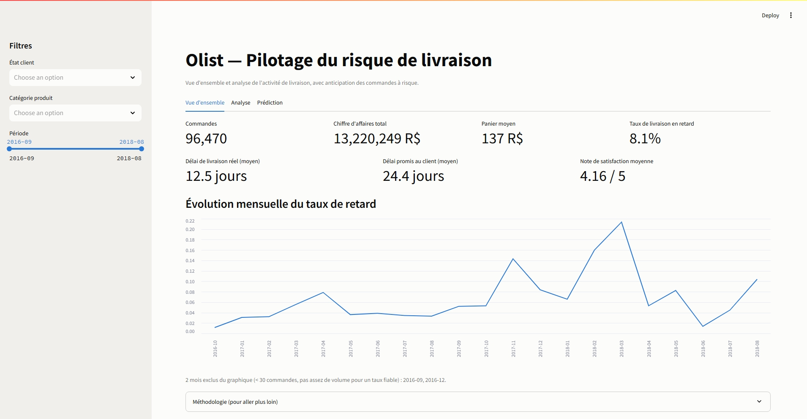
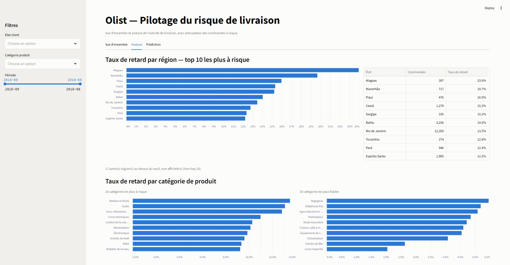
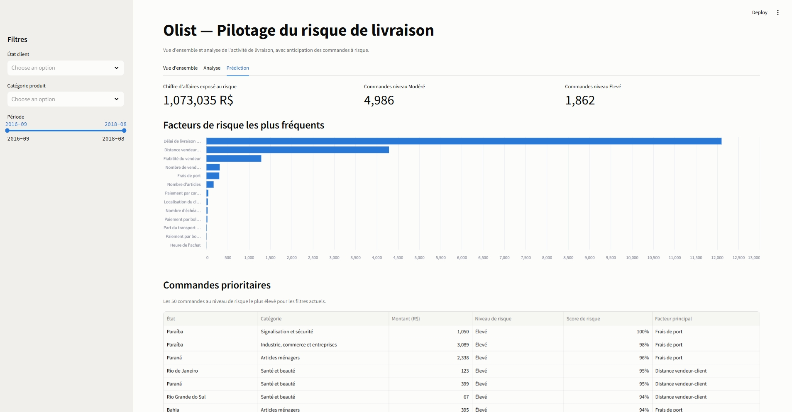

# Olist — Delivery-Risk & Satisfaction Command Center

Prédire, dès l'instant de l'achat, si une commande arrivera en retard — et rendre
cette prédiction exploitable directement dans l'entrepôt de données, pas dans un
notebook à côté.

## Le problème

Sur une place de marché, la date de livraison promise est un contrat implicite avec
le client. Quand elle est tenue, le client revient ; quand elle est rompue, il part
en laissant une mauvaise note. Sur les données Olist, l'écart est net :

> **Une commande livrée en retard obtient en moyenne 2,57/5 de satisfaction, contre
> 4,29/5 à l'heure — 1,73 point de moins.**

Un retard ne coûte pas qu'une livraison : il coûte un client. D'où l'intérêt de
détecter le risque *à l'achat*, quand il est encore temps d'agir (relancer le
vendeur, ajuster la promesse client), plutôt qu'après la livraison, quand le mal est
fait.

## Ce que fait le projet

1. Un modèle prédit, à partir des seules informations connues à l'instant de l'achat,
   la probabilité qu'une commande soit livrée en retard.
2. Cette prédiction — score, niveau de risque, facteurs explicatifs — est **écrite
   dans l'entrepôt DuckDB** comme une dimension supplémentaire du star schema,
   filtrable par région, catégorie et période au même titre que n'importe quelle
   mesure BI classique.
3. Un dashboard Streamlit restitue le tout pour un utilisateur métier, sans
   vocabulaire technique.
4. Un module complémentaire analyse le texte des avis clients négatifs pour en
   détecter automatiquement les motifs récurrents (retard, livraison incomplète,
   produit endommagé, produit incorrect), restitués eux aussi comme dimension
   filtrable du dashboard — même logique d'intégration AI↔BI que la prédiction de
   retard, appliquée cette fois à du texte plutôt qu'à des features tabulaires.

## Démo

| Vue d'ensemble | Analyse | Prédiction |
|---|---|---|
|  |  |  |

**Démo en ligne : [à venir]** — déploiement Streamlit Community Cloud en cours.

## Architecture

Cinq couches, de la donnée brute à la prédiction réinjectée :

```
raw (DuckDB)      staging (views)      intermediate (tables)      marts (star schema)      main
─────────────     ─────────────────    ──────────────────────     ──────────────────────    ──────────────────────
9 CSV Olist   →   typage, nettoyage →  agrégation à la maille  →  fct_orders +          →   order_risk_scores
tels quels        grain = source       commande, jointures         dim_customer/           order_risk_drivers
                                                                    product/date/geo        review_insights
                                                                                             (prédictions, features,
                                                                                              motifs d'insatisfaction)
```

`main.review_insights` (`order_id`, `motif`, `sentiment`, `texte_nettoye`) est produit
par le module `src/nlp/` (règles regex figées + classifieur TF-IDF/régression
logistique), pas par le pipeline dbt — mais rejoint le même schéma `main` que les
prédictions de retard, avec la même logique de dimension filtrable.

Le star schema (`marts`) est le cœur BI classique : un fait `fct_orders` (grain
commande, mesures `is_late`, `total_price`, `total_freight`...) relié à quatre
dimensions (`dim_customer`, `dim_product`, `dim_date`, `dim_geography`). Le schéma
complet est documenté dans [`docs/star_schema.md`](docs/star_schema.md).

Ce que ce schéma seul ne montre pas — et qui est le vrai sujet du projet — c'est que
`main.order_risk_scores` et `main.order_risk_drivers` se joignent à ce même fait par
`order_id`, exactement comme n'importe quelle autre table de l'entrepôt.

## AI ↔ BI : la prédiction vit dans l'entrepôt

Le risque de ce type de projet est de construire un modèle correct et un dashboard
propre, mais adjacents — un notebook d'un côté, un rapport BI de l'autre. La preuve
que ce n'est pas le cas ici : la prédiction se filtre exactement comme une mesure BI,
via une jointure à cinq tables :

```sql
select
    c.customer_state, p.product_category_name, strftime(o.date_key, '%Y-%m') as mois,
    count(*) filter (where r.is_flagged_risk) as n_a_risque
from main.order_risk_scores r
join marts.fct_orders    o using (order_id)
join marts.dim_customer  c using (customer_id)
join marts.dim_product   p using (product_key)
join marts.dim_date      d on d.date_key = o.date_key
where r.is_in_sample = false
group by 1, 2, 3
order by n_a_risque desc
```

| customer_state | product_category_name | mois | n_a_risque |
|---|---|---|---|
| SP | health_beauty | 2018-08 | 232 |
| SP | bed_bath_table | 2018-08 | 220 |
| SP | housewares | 2018-08 | 180 |

Aucune logique spéciale, aucun export intermédiaire : le score de risque est une
colonne comme une autre, jointe et filtrée par n'importe quel outil BI qui sait lire
DuckDB. Détail complet de cette intégration :
[`docs/prediction_integration_report.md`](docs/prediction_integration_report.md).

## Résultats — avec honnêteté

| | Dummy (plancher) | Régression logistique (retenue) | LightGBM |
|---|---|---|---|
| PR-AUC (test) | 0,055 | **0,113** | 0,087 |

- **PR-AUC de 0,113 contre un plancher no-skill de 0,055** : un signal réel, environ
  2× le hasard — modeste, pas nul.
- **La régression logistique bat LightGBM** (0,113 vs 0,087), un résultat
  contre-intuitif qu'on pourrait vouloir écarter. Diagnostic : LightGBM sur-apprend
  nettement plus (ratio PR-AUC train/test ×3,2 contre ×1,4 pour la régression) — sur
  un signal aussi faible, la capacité supplémentaire de LightGBM mémorise du bruit
  plutôt qu'elle n'apprend un vrai pattern. Diagnostic complet, avec test d'ablation :
  [`docs/explainability_report.md`](docs/explainability_report.md).
- **Seuil de décision retenu : 0,60** — un arbitrage métier (le coût d'une fausse
  alerte est faible, celui d'un retard non détecté ne l'est pas), pas une valeur
  optimisée en boucle sur le test. À ce seuil : rappel de 74 %, précision de 11 %.

**La conclusion la plus importante n'est pas un chiffre : le retard est
structurellement difficile à prédire à l'instant de l'achat**, parce que ses causes
réelles (grève, aléa météo, engorgement du dernier kilomètre) surviennent *après* la
commande. Les features disponibles à l'achat (distance vendeur-client, historique du
vendeur, délai promis...) sont des proxies de ce risque, pas ses causes. Preuve à
l'appui : le taux de retard mensuel varie de **1,36 % à 21,36 %** selon la période,
une volatilité qu'aucune feature connue à l'achat ne peut anticiper. Un score modeste
n'est donc pas un échec d'ingénierie — c'est la limite intrinsèque du problème, et le
projet le documente plutôt que de le maquiller.

## La discipline anti-fuite

Le point technique qui distingue ce projet d'un exercice de classification standard :
la fuite de données se cache à trois endroits, chacun verrouillé par une assertion
exécutable, pas seulement une bonne intention documentée.

1. **Cible** — `is_late` ne peut être calculée que pour les commandes livrées ; les
   colonnes de date de livraison réelle qui servent à la construire sont bannies des
   features (même colonne, deux usages : interdite en entrée du modèle, indispensable
   pour fabriquer le label).
2. **Split temporel strict** — train = achats avant 2018-06-01, test = après.
   Contrairement à un split aléatoire, aucune commande de test ne peut influencer
   l'entraînement, même indirectement.
3. **Le taux de retard vendeur, correctement point-in-time** — c'est le piège le plus
   subtil du projet. La feature "fiabilité historique du vendeur" ne doit compter que
   les commandes de ce vendeur **déjà livrées** avant l'achat courant — pas
   simplement *achetées* avant. Une commande achetée la veille mais pas encore
   livrée n'a pas de résultat connaissable : la compter aurait fuité un label
   implicite. Le code utilise un `merge_asof` sur la date de *livraison* passée,
   avec inégalité stricte, précisément pour cette raison.

## Stack technique

| Outil | Rôle | Pourquoi ce choix |
|---|---|---|
| DuckDB | Entrepôt analytique | Base fichier unique, zéro serveur à administrer, largement suffisante pour ~96 k lignes |
| dbt Core (dbt-duckdb) | Transformation SQL, tests de qualité | Couche staging/intermediate/marts testée (`unique`, `not_null`, `relationships`), pas de SQL ad hoc |
| scikit-learn | Pipeline ML (régression logistique retard livraison + classification TF-IDF/régression logistique multinomiale des motifs d'insatisfaction) | Modèle de production linéaire, interprétable, généralise mieux que LightGBM sur le retard ; même logique légère (TF-IDF + linéaire, sans dépendance NLP supplémentaire) pour classer le texte des avis |
| LightGBM + SHAP | Diagnostic d'explicabilité (pas le modèle de production) | Lit les interactions non-linéaires qu'un modèle linéaire ne peut pas capter |
| Streamlit | Dashboard | Le plus rapide à mettre en production pour un usage interne/démo |


## Comment lancer le projet

```bash
git clone <url-du-depot>
cd olist-projet
python -m venv .venv && source .venv/bin/activate   # ou .venv\Scripts\activate sous Windows
pip install -r requirements.txt

# Télécharger le dataset Olist Brazilian E-Commerce sur Kaggle et extraire les 9 CSV dans data/raw/ :
# https://www.kaggle.com/datasets/olistbr/brazilian-ecommerce

python src/ingestion/load_raw.py                    # charge les CSV dans DuckDB (schéma raw)
dbt --project-dir dbt --profiles-dir dbt run         # construit staging + intermediate + marts
python src/features/build_features.py               # features point-in-time
python src/models/predict.py                         # score + drivers réinjectés dans l'entrepôt
streamlit run app/app.py                             # dashboard, sur http://localhost:8501
```

Détail complet du déploiement (mode local vs démo publique) :
[`docs/deployment.md`](docs/deployment.md).

## Limites assumées

- **Pas de filtre par vendeur individuel** dans le dashboard : une commande peut
  avoir plusieurs vendeurs (grain `order_items` ≠ grain commande), et créer une
  dimension dédiée aurait exigé une dénormalisation non justifiée à ce stade.
- **3 des 19 features** (montant payé, nombre d'échéances, mode de paiement)
  reposent sur une hypothèse non prouvée par les données : que ces informations sont
  fixées au checkout, donc connues avant l'achat. Le dataset ne fournit aucun
  timestamp permettant de le vérifier.
- **Probabilités non calibrées** : `class_weight="balanced"` recalibre les scores
  pour compenser le déséquilibre des classes — un score de 0,60 n'est pas "60 % de
  chances de retard", c'est un point de coupure sur la courbe précision/recall.
- **Un seul split temporel**, pas de validation glissante multi-fenêtres — non fait
  par contrainte de temps.
- **Précision d'environ 11 % au seuil retenu** : sur 100 commandes flaguées, une
  dizaine seront réellement en retard. Assumé et expliqué plus haut (plafond de
  signal, pas un bug).

## Documentation détaillée

Le détail technique, les preuves et les chiffres complets sont dans
[`docs/`](docs/README.md).

- **Motifs d'insatisfaction (module NLP)** : F1 macro de 0,91 sur les 4 motifs
  retenus (retard, livraison incomplète, produit endommagé, produit incorrect) —
  module descriptif complémentaire à la prédiction de retard, jamais une feature du
  pipeline prédictif (`is_late`) : détail, limites et seuils dans
  [`docs/review_insights_report.md`](docs/review_insights_report.md).
